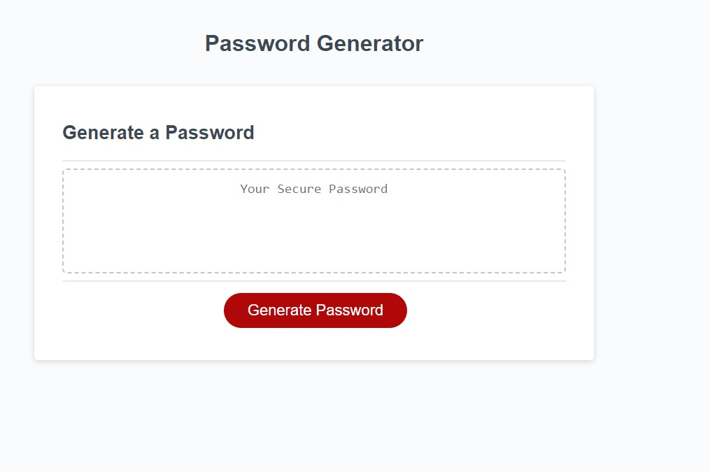
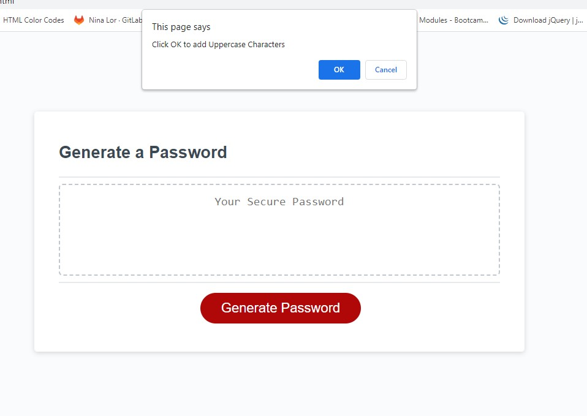
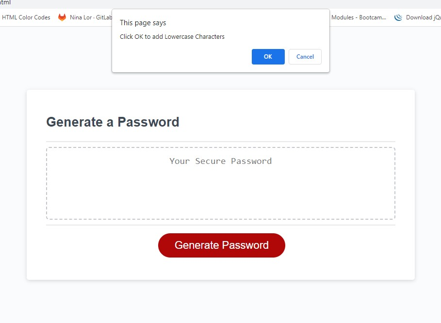
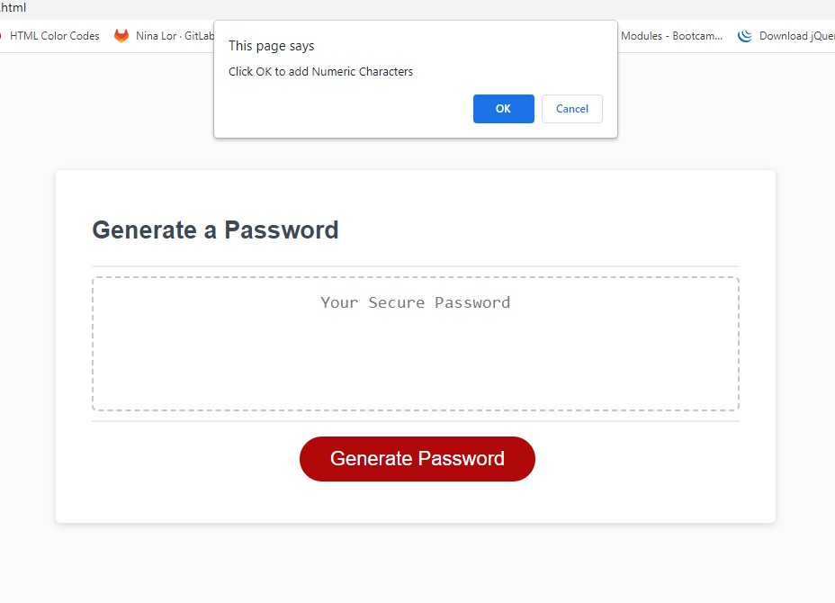
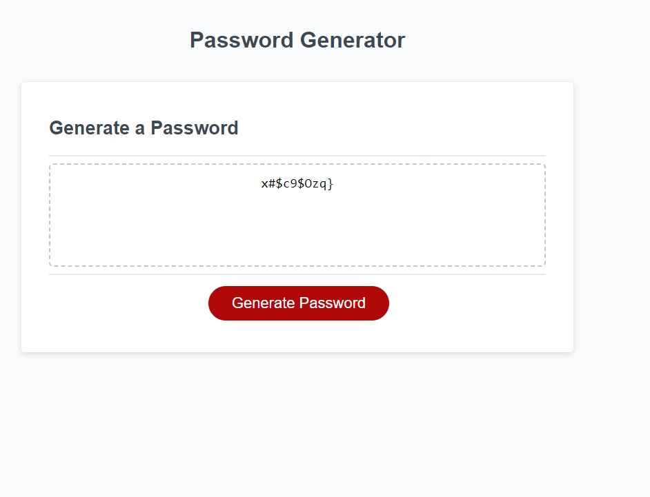

* Create Password / Password Generator

This webpage is created to show you my password generator.

The purpose of this generator is suppose to give you a random code when the prompt is command of your given selection.

This is what the front main page will show.

The prompt will ask if you want any of the followings:
1. Enter an number from 8-128 for length of password

2. Uppercase

2. Lowercase

3. Numbers

4. Symbols or special characters

If you click yes, than the prompt will be generated to your random password. If you click cancel, it will not generate into your random password.

5. This is an example of the random password that was generated.

*** trial in error - password was not able populate random password ***